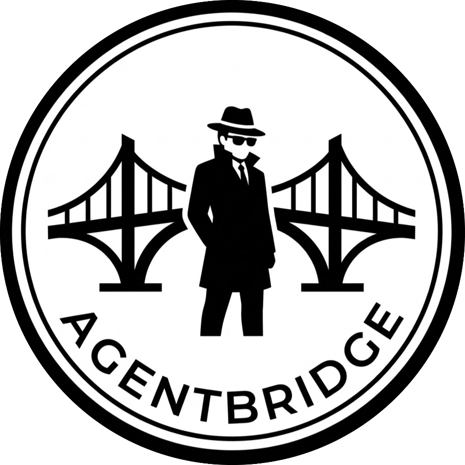
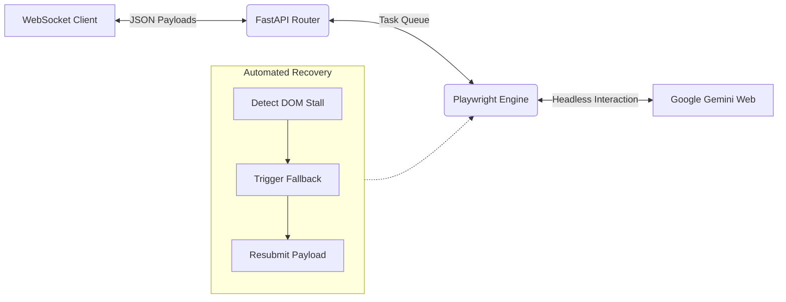
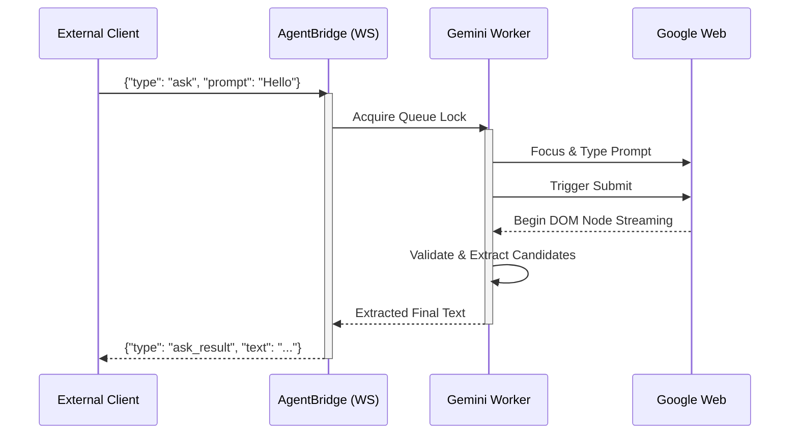

<div align="center">
  <a href="https://agentbridge-cloud.vercel.app">
    
  </a>
  
  <br/>
  <br/>

  <h1 style="font-size: 3rem; font-weight: 900; margin: 0; padding: 0;">AgentBridge</h1>

  <a href="https://agentbridge-cloud.vercel.app">
    
  </a>

  <br/>

  
  
  
  

  <br/><br/>

  [](https://agentbridge-cloud.vercel.app)
  [](https://github.com/Yogarathinam/AgentBridge/releases/latest)
  [](https://yogarathinam.github.io/AgentBridge/)
  [](https://agentbridge-cloud.vercel.app/feedback)
  
  <br/>

  [Official Website](https://agentbridge-cloud.vercel.app) • [Stress Tester](https://yogarathinam.github.io/AgentBridge/) • [Leave Feedback](https://agentbridge-cloud.vercel.app/feedback)
</div>


<div align="center">
  
  <br/>
  <i>Seamlessly routing local JSON payloads into the Gemini interface.</i>
</div>


## The Core Philosophy

> Language model APIs are notoriously expensive or heavily rate-limited for local development and high-volume personal automation. While web interfaces are highly capable and free, they are constructed strictly for human interaction, making them fragile and frustrating to script against.

**AgentBridge** serves as a fault-tolerant translation layer. It manages a persistent, headless Chromium session, interprets volatile UI states, and exposes a clean, queue-driven JSON WebSocket API to your local development environment.

## Execution Architecture

AgentBridge separates network routing, browser automation, and state recovery into isolated layers to guarantee maximum uptime.

### Infrastructure Flow


### Request Lifecycle



## Performance & Endurance

To ensure stability under continuous load, AgentBridge utilizes a rigorous locking system and an automated 4-stage recovery pipeline. Below are the results from our most recent endurance tests using the [Live Stress Tester](https://yogarathinam.github.io/AgentBridge/).

| Metric | Result | Environment Notes |
| :--- | :--- | :--- |
| **Requests Processed** | `500` | Continuous sequential processing |
| **Success Rate** | `<span style="color: #22c55e; font-weight: bold;">99%</span>` | Maintained via auto-recovery state machine |
| **Average Duration** | `9.36s` | End-to-end response time |
| **Failures** | `1 TIMEOUT` | Hard timeout, handled gracefully without crashing |
| **Context Restarts** | `Auto` | Browser resets every 100 requests to clear memory leaks |


## Installation & Setup

<details>
<summary><strong>Option A: Windows Installer (Recommended)</strong></summary>

The most straightforward method for Windows environments is utilizing the pre-compiled executable.

1. Download `AgentBridgeSetup.exe` from the [Latest Release](https://github.com/Yogarathinam/AgentBridge/releases/latest).
2. Run the installer and proceed through the setup wizard.
3. Launch AgentBridge directly from your Start menu.

</details>

<details>
<summary><strong>Option B: Build from Source</strong></summary>

For macOS, Linux, or contributing to the core logic.

```bash
# 1. Clone the repository
git clone [https://github.com/Yogarathinam/AgentBridge.git](https://github.com/Yogarathinam/AgentBridge.git)
cd AgentBridge

# 2. Create and activate a virtual environment
python -m venv .venv
# Windows: .venv\Scripts\activate
# Unix: source .venv/bin/activate

# 3. Install core dependencies
pip install -r requirements.txt

# 4. Install Playwright browser binaries
playwright install chromium

# 5. Launch the application
python bootstrap.py
```
</details>

## Interaction Protocol

### 1. Initialization
Upon launching the Desktop UI, select **Start Server**. Follow up by clicking **Authenticate**. If you do not possess an active session, a visible Chrome window will launch. Log into your Google Account, close the window, and AgentBridge will transition to an **OPERATIONAL** status.

### 2. WebSocket API
Once operational, external clients can interface via `ws://127.0.0.1:8765/ws`. Incoming requests are strictly queued, processing simultaneously fired payloads in exact sequence.

<details>
<summary><strong>View JSON Payloads</strong></summary>

**Example Request:**
```json
{
  "type": "ask",
  "request_id": "req-12345",
  "payload": {
    "prompt": "Write a python function to reverse a string."
  }
}
```

**Example Response:**
```json
{
  "type": "ask_result",
  "request_id": "req-12345",
  "payload": {
    "text": "def reverse_string(s):\n    return s[::-1]",
    "chat_url": "[https://gemini.google.com/app/abcdef12345](https://gemini.google.com/app/abcdef12345)"
  }
}
```
</details>


## Diagnostics & Watchdog Recovery

Web automation is inherently volatile. AgentBridge discards rudimentary "stable text" polling in favor of deep DOM diagnostics. It maps exact `messageCount` vectors and `latestLen` states to comprehend the underlying interface.

If a request enters an invalid state, visual and structural dumps are automatically captured:

```text
📁 profile/diagnostics/
├── 📄 failure_20260622_153022_REQ123.html  # Full DOM structure dump
└── 🖼️ failure_20260622_153022_REQ123.png   # Visual screen state
```

### The Recovery Matrix
* `PROMPT_NOT_TYPED`: The worker attempts to re-acquire focus on the input box and inject the payload again.
* `PROMPT_NOT_SUBMITTED`: Detecting the prompt lingering in the textbox, the worker issues a secondary hardware `Enter` keystroke.
* `GENERATION_STALLED`: Should the generation spinner freeze, the worker forcefully triggers the "Stop" button, reloads the page, and resubmits the original payload.
* `SCRAPE_TIMEOUT`: If a chat thread becomes unresponsive or poisoned by context length, the worker abandons it and forces a clean chat instance.


## Feedback & Support

This infrastructure is actively maintained. If you encounter routing issues, require feature expansions, or wish to share your implementation of AgentBridge, please utilize the portal below.

[Submit Developer Feedback](https://agentbridge-cloud.vercel.app/feedback)

## License

Built with **PyQt6**, **FastAPI**, and **Playwright**. <br/>
Designed for seamless integration with custom browser extensions, local agentic workflows, and web automation pipelines.
